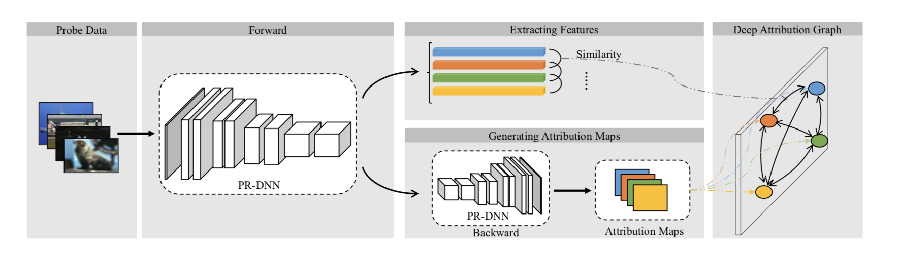
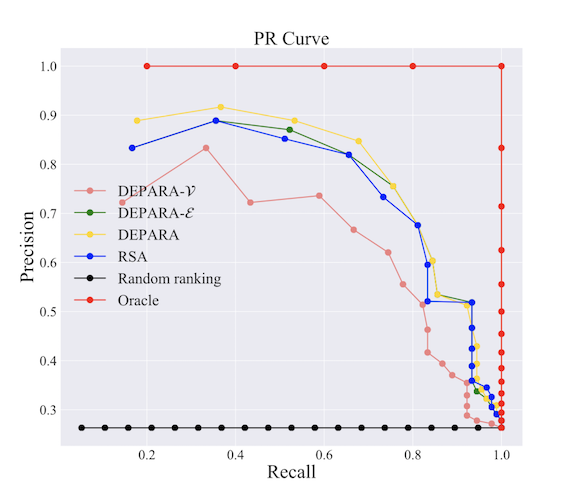
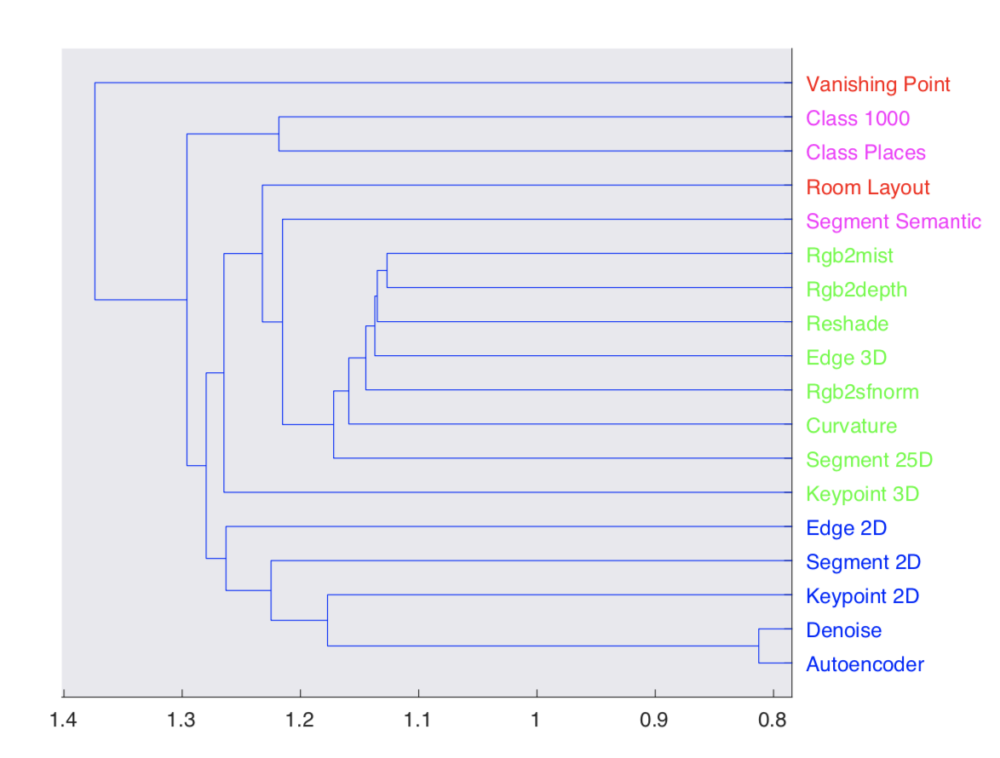
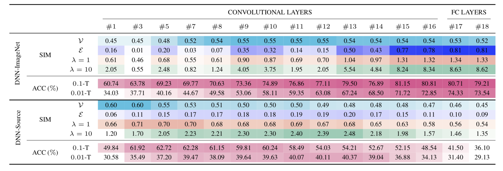

# DEPARA

- [*"DEPARA : Deep Attribution Graph for Deep Knowledge Transferbility"*](https:), CVPR 2020(oral).(released soon)



## Getting Started

These instructions below will get you a copy of the project up and running on your local machine for development and testing purposes.

#### Prerequisites

Install the following:

```
- Python >= 3.6
- pytorch >= 1.0.1
- torchvision >= 0.2.2
```

Then, install python packages:

```
pip install -r requirements.txt
```

#### Datasets

Here we utilize [syn2real](https://github.com/VisionLearningGroup/taskcv-2017-public/tree/master/classification) closed-set classification task (train/validation/test), for more infomation about *syn2real* dataset please refer to [*Syn2Real: A New Benchmark for Synthetic-to-Real Visual Domain Adaptation*](ai.bu.edu/syn2real).

You can download the datasets in your project **$DIR** with:

```
cd $DIR/data
wget http://csr.bu.edu/ftp/visda17/clf/train.tar
tar xvf train.tar

wget http://csr.bu.edu/ftp/visda17/clf/validation.tar
tar xvf validation.tar
```

We view part *train* as source domain(synthetic) and part *validation* as target domain(real), and we split each domain into train/validation/test in a ratio of 7:2:1.

```  
python split_dataset.py --part synthetic --data-dir $DIR/data --split-path syn2real-data
python split_dataser.py --part mscoco --data-dir $DIR/data --split-path syn2real-data
```

After splitting, the datasets should be arranged in the following format:

```
|- syn2real-data
|   |---synthetic
|   |   |---train
|   |   |   |---0001
|   |   |   |   |---src_1_02691156_1b0b1d2cb9f9d5c0575bd26acccafabd__10_10_150.png
|   |   |   |---...
|   |   |   |---0012
|   |   |---val
|   |   |   |---0001
|   |   |   |---...
|   |   |   |---0012
|   |   |---test
|   |   |   |---src_1_02691156_1b0b1d2cb9f9d5c0575bd26acccafabd__112_123_150.png
|   |   |   |---...
|   |---mscoco
|   |   |---train
|   |   |   |---0001
|   |   |   |   |---aeroplane_1363018.jpg
|   |   |   |---...
|   |   |   |---0012
|   |   |---val
|   |   |   |---0001
|   |   |   |---...
|   |   |   |---0012
|   |   |---test
|   |   |   |---aeroplane_1363101.jpg
|   |   |   |---...
```

## Task Transferability

We test Task Transferability on Taskonomy Models. For pre-trained models, testing images, please follow the instruction of [TransferabilityfromAttributionMaps](https://github.com/zju-vipa/TransferbilityFromAttributionMaps). Make sure to utilize those codes to generate each task's features and attribution maps. We also provide ready-made [features](https://drive.google.com/open?id=1lYJnVOb8GBZuMBePf50BTcQJoaGL5o_y) and [attributions affinity](https://drive.google.com/open?id=1j42G90dD5NbPz9nACkUCtpHIIZ36SDMp) in GoogleDrive. Move [attributions affinity](https://drive.google.com/open?id=1j42G90dD5NbPz9nACkUCtpHIIZ36SDMp) to $result_save.

Generate edges of the graph:

```
cd tools
python spearman_edge.py --feature-dir $FEATURE --save-dir result_save --dataset taskonomy 
python spearman_edge.py --feature-dir $FEATURE --save-dir result_save --dataset coco
python spearman_edge.py --feature-dir $FEATURE --save-dir result_save --dataset indoor
```

#### Visualization

Plot *Precision&Recall* curve:

```
cd $DIR/prcurve
python plot.py --dataset taskonomy --save-dir result_save
```

e.g.



Plot *Task Similarity Tree* of DEPARA:

```
matlab -nosplash -nodesktop task_similarity_tree.m
```

e.g.



## Layer Transferability

#### Dataset Shrinkage

We randomly select 1/10 of the whole dataset's train images to form a shrinking dataset:

```
cd $DIR/syn2real-data
python shrink.py --data-dir syn2real-data --save-dir syn2real-data-tenth --shrink-ratio 10
```

Also, 1/100:

```
python shrink.py --data-dir syn2real-data --save-dir syn2real-data-hundredth --shrink-ratio 100
```

#### Training

We first train some baselines in each domain. Baseline(Domain Synthetic):

```
cd $DIR/tools
python vgg_syn2real.py --data-dir syn2real-data --task-name synthetic --log-dir $LOG --model-save-dir $SAVE 
```

Baseline(Domain Real) with complete/0.1/0.01 datasets:

```
python vgg_syn2real.py --data-dir syn2real-data --task-name mscoco --log-dir $LOG --model-save-dir $SAVE 
python vgg_syn2real.py --data-dir syn2real-data-tenth --task-name mscoco --log-dir $LOG --model-save-dir $SAVE 
python vgg_syn2real.py --data-dir syn2real-data-hundredth --task-name mscoco --log-dir $LOG --model-save-dir $SAVE 
```

You can skip execute baseline(real) which will not be used in the next steps, but baseline(synthetic) is essential.

#### Finetuning(transfer)

Finetune with 1/10(or 1/100) target data and pre-trained models trained on the synthetic domain:

```
python vgg_layer_transfer.py --data-dir syn2real-data-tenth --source synthetic
python vgg_layer_transfer.py --data-dir syn2real-data-hundredth --source synthetic
```

Finetune with 1/10(or 1/100) target data and ImageNet pre-trained models:

```
python vgg_layer_transfer.py --data-dir syn2real-data-tenth --source Imagenet
python vgg_layer_transfer.py --data-dir syn2real-data-hundredth --source Imagenet
```

#### Test Performance of DEPARA for Layer Selection

Extract DEPARA from finetuned models(last layer and other conv-layers) with randomly selected 200 images from *part val*, you can also test on other images:

```
python vgg_extract.py --target --imlist imlist_200.txt
python vgg_extract.py --imlist imlist_200.txt
```

Test performance w.r.t. each layer:

```
python layer_select.py
```



## Todo

Test more network architectures and tasks, on which we test performance of DEPARA.

Develop advanced metrics and attribution methods for establishing DEPARA. 

## Acknowledgement

We thank the [TransferabilityfromAttributionMaps](https://github.com/zju-vipa/TransferbilityFromAttributionMaps) and [pytorch-cnn-visualizations](https://github.com/utkuozbulak/pytorch-cnn-visualizations) for supporting the base codes of this repo.

We thank the [*syn2real*](ai.bu.edu/syn2real) dataset for conducting experiments upon it.

## Citation

```

```

## Contact

If you have any question, please feel free to contact

Jie Song, sjie@zju.edu.cn; 

Yixin Chen, chenyix@zju.edu.cn.
